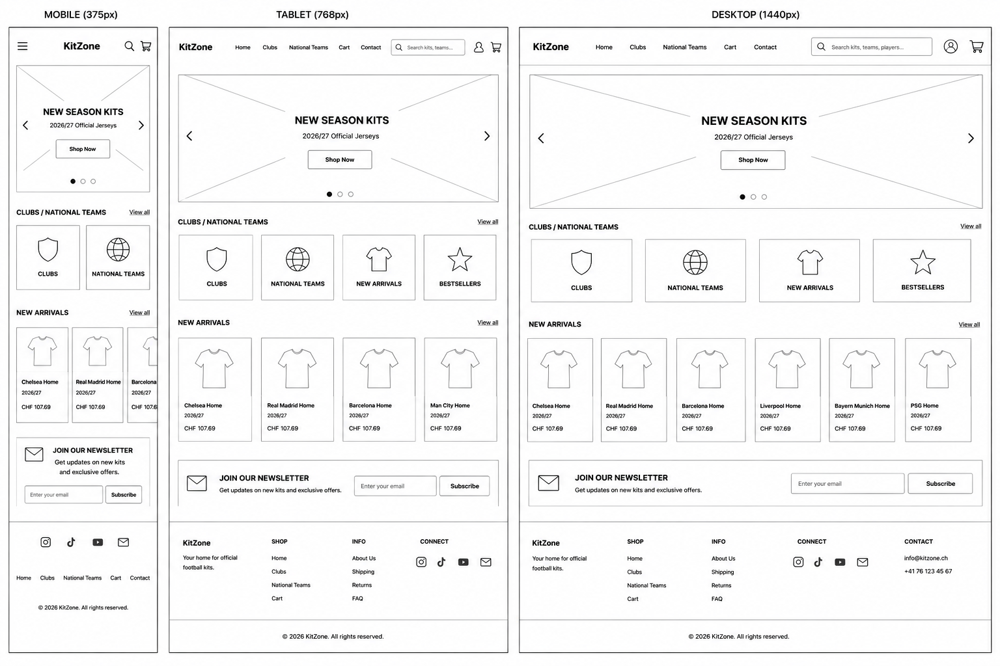

# Wireframes

## Ziel

Vor Beginn der Programmierung wurde ein Wireframe erstellt, um den grundsätzlichen Aufbau des Webshops zu planen.

Das Wireframe wurde mithilfe von KI erstellt und diente als Grundlage für die Entwicklung von KitZone. Während der Umsetzung wurden einzelne Bereiche angepasst und erweitert, sodass das endgültige Design vom ursprünglichen Wireframe leicht abweicht.

Das Wireframe dient ausschliesslich der Layoutplanung und zeigt die Position der wichtigsten Elemente der Website.

---

# Enthaltene Seitenbereiche

Das Wireframe umfasst folgende Bereiche:

- Header mit Navigation
- Suchleiste
- Hero-Bereich
- Produktkategorien
- Produktübersicht
- Newsletter-Bereich
- Footer

---

# Responsive Varianten

Für die Planung wurden drei verschiedene Bildschirmgrössen berücksichtigt:

- Mobile (375 px)
- Tablet (768 px)
- Desktop (1440 px)

Dadurch konnte sichergestellt werden, dass die Website auf verschiedenen Geräten sinnvoll aufgebaut ist.

---

# Wireframe

Nachfolgend ist das erstellte Wireframe dargestellt:

